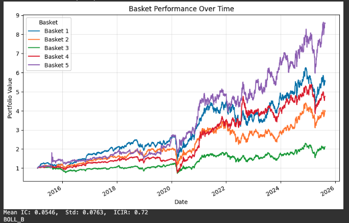

# EverBrook_US_LS_Backtester

## 📊 Quant Research Project Overview

This repository contains **factor models** and **long–short backtesting engines** built and maintained in Google Colab.  
It provides a complete workflow — from factor construction and normalization to portfolio optimization, monthly rebalancing, and performance evaluation based on Russell 3000 stocks.

---

## 🧩 Core Dependencies
- **numpy** — numerical computing  
- **pandas** — data processing and alignment  
- **matplotlib** — visualization  
- **cvxpy** — portfolio optimization  

---

## 🔍 Repository Structure
- `data/` — stores Russell 3000 daily data (open, high, low, volume, and sector codes)  
- `normalize/` — includes equity beta factors such as beta, momentum, turnover, volatility, and P/B ratio  
- `factor/` — defines the factor pipeline used to compute daily factor exposures for backtesting  
- `backtest/` — implements the backtesting engine to calculate monthly factor returns, 5-basket performance, and IC metrics  

---

## ⚙️ Key Functions
- **`neutralize_cross_sectional_lagged()`** — cross-sectionally neutralizes alpha factors by beta-style factors  
- **`optimize_portfolio()`** — enforces optimization constraints within each basket to align backtest results with production portfolios  
- **`chain_mtd_rebalance()`** — rebalances monthly at the start of each month using prior-day factor values; computes daily returns and reinvests gains  
- **`compute_monthly_ic()`** — computes the Pearson correlation between factor values and next-month returns  
- **`backtest()`** — end-to-end backtest engine producing monthly factor returns, basket spreads, and IC summaries  

---

## 📉 Demo: Bollinger-Style Factor

The **Bollinger factor** is defined as:

$$
\text{Factor} = \frac{P - \text{Low}}{\text{High} - \text{Low}} \\
,\ \quad \text{High} = \text{MA} + k \times \text{STD}, \quad \text{Low} = \text{MA} - k \times \text{STD}
$$

The chart below illustrates the backtester output for the Russell 3000 universe from 2016 to 2025, showing both the daily cumulative return and the Information Coefficient (IC) series of this technical factor. It demonstrates that the signal maintains an average predictive power above 0.05, indicating a momentum-like structure where past returns have forward-looking strength over the next 30 days.

This visualization provides a clear view of which basket performs best, how performance evolves throughout the year, and how the factor behaves during market drawdowns. Notably, the factor experienced a larger drawdown in 2024 than the market itself — a sign of a potential momentum crash — yet it also exhibits cyclical recovery patterns, often mean-reverting in the short term and trending upward over longer horizons.

While this factor alone may not be a stand-alone alpha, it helps guide how to combine it with other momentum factors to build a stronger and more robust composite model.

---

## 🔧 Ongoing Improvements
- Streamline and modularize risk-factor computation  
- Migrate computation to **Polars** or **PyTorch** for GPU acceleration  
- Evaluate full long–short portfolio performance metrics  
- Incorporate **market-impact and trading-cost** approximations  

---

## 🚀 How to Run (unavailable)
1. Open notebooks in [Google Colab](https://colab.research.google.com).  
2. Install dependencies from `requirements.txt`.  
3. Run cells sequentially to reproduce results.

---

## 📈 Example Notebook

